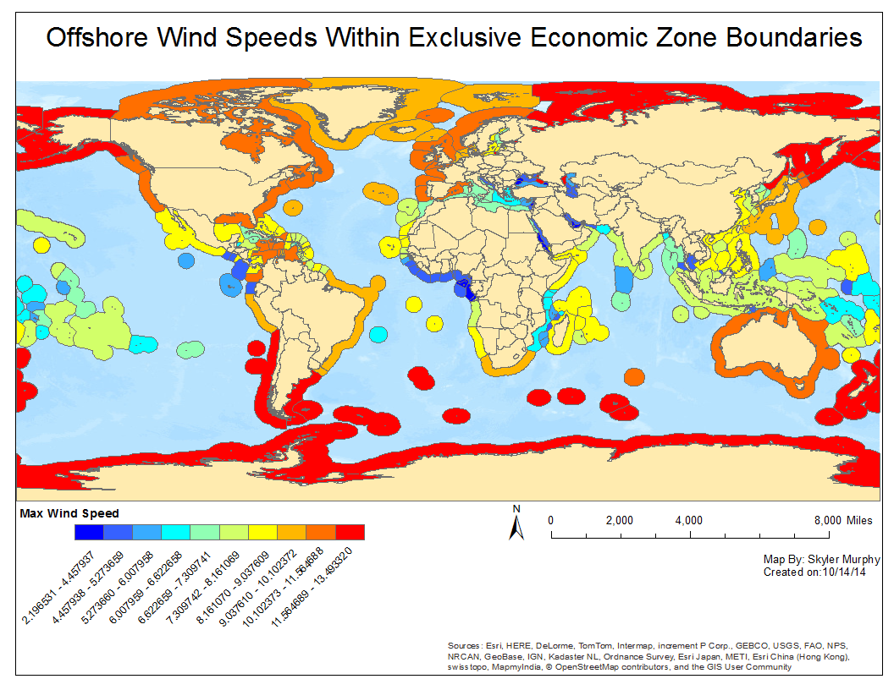

# Lab 2

## Offshore Max Wind Speed

## Summary of Top Countries

The top 3 countries by MAX wind speed were:

1. [Heard and McDonald Islands]
1. [Kerguelen Islands]
1. [Crozet Islands]

The top 3 countries by MEAN wind speed were:

1. [Crozet Islands]
1. [Macquarie Islands]
1. [Kerguelen Islands]

#Python Script

H:\esm296-4f\github\lab2\wind_script.py

