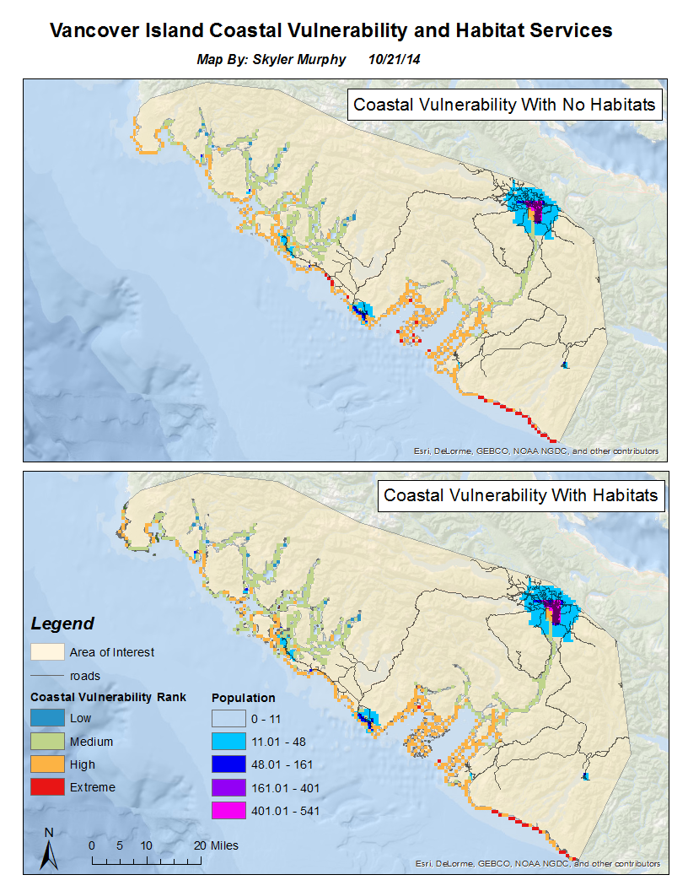

###Skyler Murphy
###10/21/14

####1. Along the west coast of Vancouver Island, there are four predominant natural coastal habitats: low dunes, high dunes, sea grass and kelp.  While all four of these are exposed to coastal hazards such as erosion and inundation during storms to varying degrees, kelp is the most vulnerable.  This is apparent from the results of running the InVest model for the Vancouver Island area.  Our results show that areas of the coast with kelp forests off shore generally have high to extreme vulnerability.  The area that is most vulnerable to coastal erosion and inundation during storms is the south west coastline in the Carmanah Walbran Provincial Park.  After kelp, sea grass ecosystems are the most vulnerable.  Much of the sea grass ecosystems along Vancouver Islands coast line are in areas of high vulnerability to erosion and inundation.

####2.  By preserving coastal habitats, it is possible to preserve natural buffers to storm erosion and inundation.  The output of our InVest model shows us that along the west coast of Vancouver Island, preserving natural high dunes will provide the greatest benefit of natural buffers to storm.  This is most apparent along the coast north of Ucluelet, within the Pacific Rim National Park Reserve.  With high dune habitat intact, the vulnerability in this area is high.  However, without the natural high dune habitat, much of the coast in this area becomes extremely vulnerable to erosion and inundation.

####3.  In my assessment of vulnerability, I took into account roads and population centers on Vancouver Island.  Taking these human factors into account, we can then find areas where habitat restoration/preservation can provide the greatest reduction to risk of damage during storm surges.  From our results, we found that the coastal area between Ucluelet and Tofino.  The benefits provided by the natural habitats in this area and the proximity of human populations and road infrastructure make this area the place of highest habitat value.