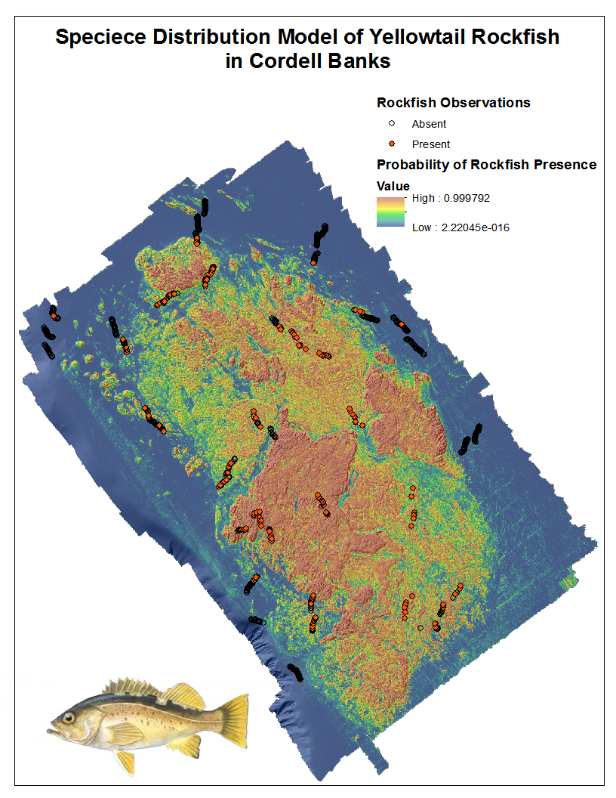
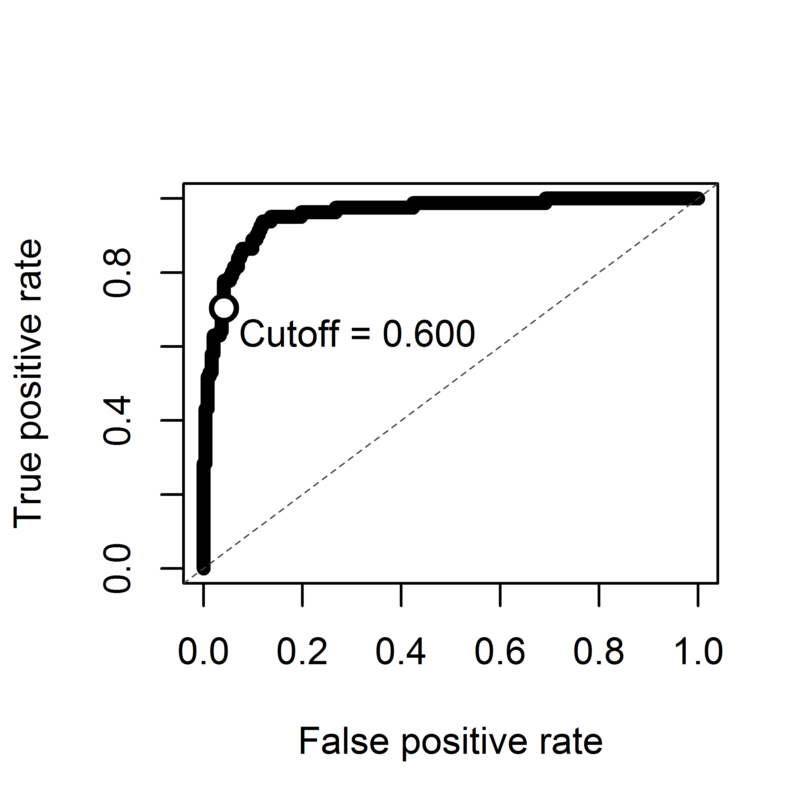

#Lab 4
###Skyler Murphy

##Species Distribution Model of Yelowtail Rockfish In Cordell Banks

###Model Performance Summary

Area under the ROC curve (auc) = 0.956

Accuracy (acc)                 = 0.895

Error Rate (err)               = 0.105

Cohen's Kappa (k)              = 0.703