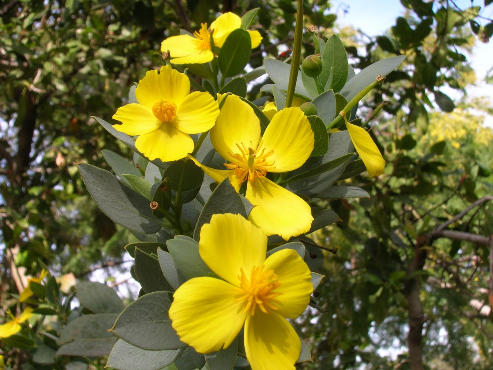
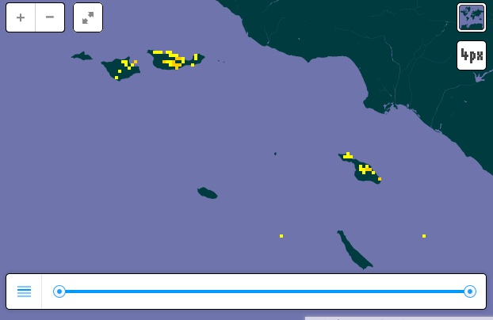
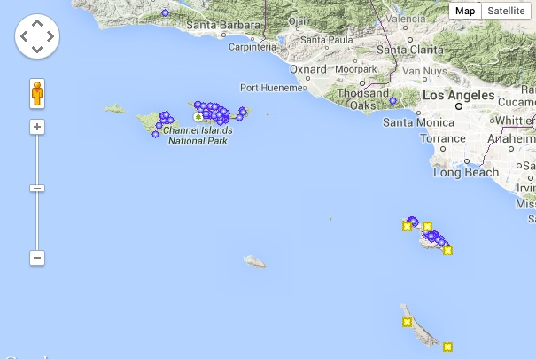

###Channel Island Tree Poppy (Dendromecon harfordii)
####Project Proposal: Skyler Murphy

The Channel Island Tree Poppy is a small perennial shurb or tree  (Dendromecon harfordii) in the poppy family (Papaveraceae) with bluish-green oval-shaped leaves and bright yellow flowers with four petals. It is endemic to the Channel Islands off southern California including San Clemente Island, Santa Catalina Island, Santa Cruz Island, and Santa Rosa Island.  It grows from 2-6 metres tall and is found mostly in the chapparal or coastal sage scrub habitats in course, well-drained soil between 15-420 meters elevation. It blooms between March and November. Dendromecon harfordii has a state rank (S-rank) of S3, meaning it is "vulnerable in the state due to a restricted range, relatively few populations (often 80 or fewer), recent and widespread declines, or other factors making it vulnerable to extirpation".   

On the Channel Islands, the tree poppy is restricted by it's range on the islands and is also threatened by feral herbivoires and changing climate due to climate change. This project will be able to identify habitats Dendromecon harfordii prefer in order to direct conservation efforts in the face of feral herbivoires and the impact of climate change on the Channel Islands.  Factors affecting D. harfordii distribution may include soil type, slope, precipitation, elevation, aspect, habitat type, and proximity to other individuals.

#####Population Distribution Maps
######gbif.org

######calfora.org

